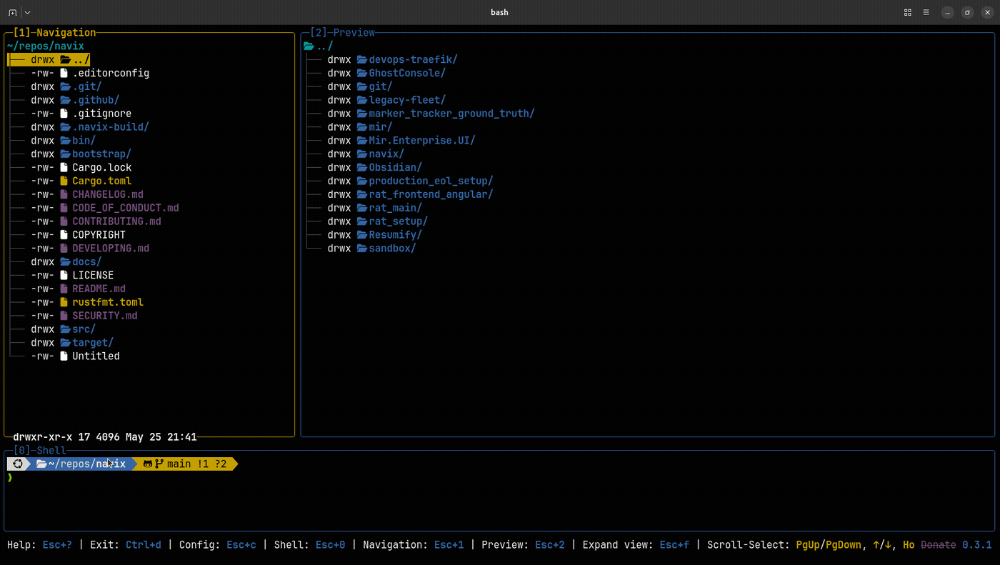
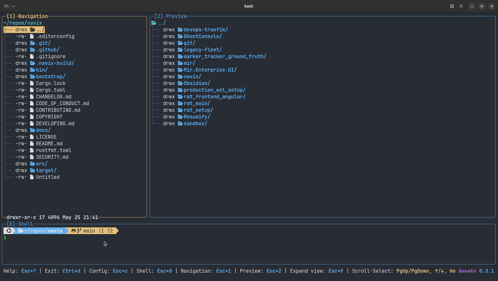
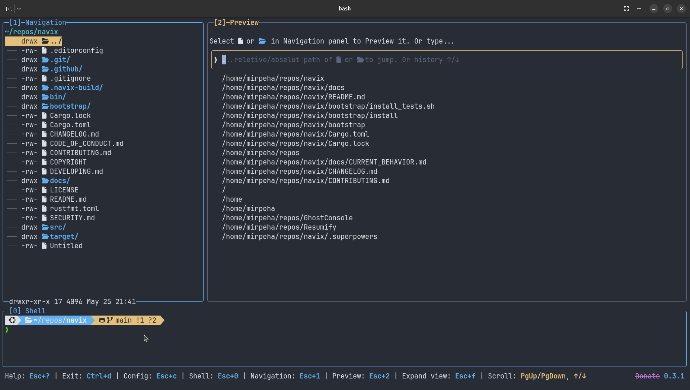
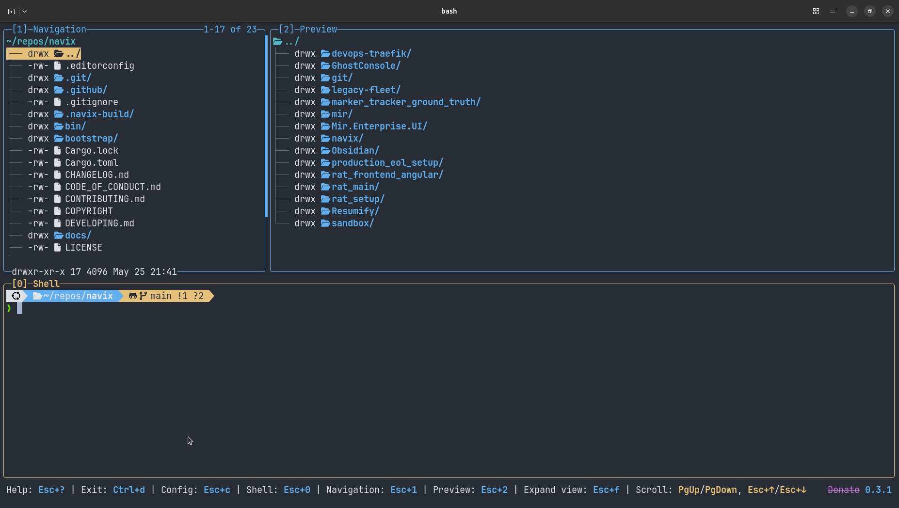

# navix

Keyboard-first Rust TUI for navigating files, previewing commands, and keeping a live shell in the same workspace.

## Why Navix

- **Three-pane workflow**: `[1] Navigation`, `[2] Preview`, `[0] Shell`.
- **Fast directory movement**: move with keys, filter live, and jump by path.
- **Preview-first commands**: file-aware `read`, `write`, and `exec` shortcuts.
- **Shell continuity**: embedded PTY keeps context while you browse.
- **Keyboard-native UX**: no mouse dependency for core flows.

## Quick Start

```bash
# run from repository root
./bin/navix

# or via Cargo
cargo run --manifest-path Cargo.toml
```

## Startup Examples

```bash
# open with Preview focused
./bin/navix --preview

# start in a specific path
./bin/navix --path ~/repos/navix/docs --navigation

# disable startup mouse capture
./bin/navix --no-mouse-capture
```

## Showcase






## Core Keys

- `Esc+0`, `Esc+1`, `Esc+2`: focus Shell / Navigation / Preview
- `Esc+c`: open config editor
- `Esc+f`: toggle fullish mode
- `Ctrl+d`: exit

For full behavior and exact panel semantics, see `docs/CURRENT_BEHAVIOR.md`.

## Documentation

- Behavior reference: `docs/CURRENT_BEHAVIOR.md`
- Developer/runtime guide: `DEVELOPING.md`
- Architecture notes: `docs/ARCHITECTURE.md`
- Engineering conventions: `docs/PROJECT_CONVENTIONS.md`
- Contribution guide: `CONTRIBUTING.md`
- Security policy: `SECURITY.md`
- Release process: `docs/RELEASE_PROCESS.md`
- Release checklist: `docs/OPEN_SOURCE_RELEASE.md`

## Platform

- Primary support target: Linux terminal environments.
- macOS is supported via release binaries for Intel and Apple Silicon.
- Native Windows is not supported.
- Windows users can run Navix through WSL using the Linux release binary (`x86_64-unknown-linux-gnu`).
- Current runtime behavior relies on Unix/Linux shell and path semantics.

## License

GPL-3.0-or-later. See `LICENSE`.
